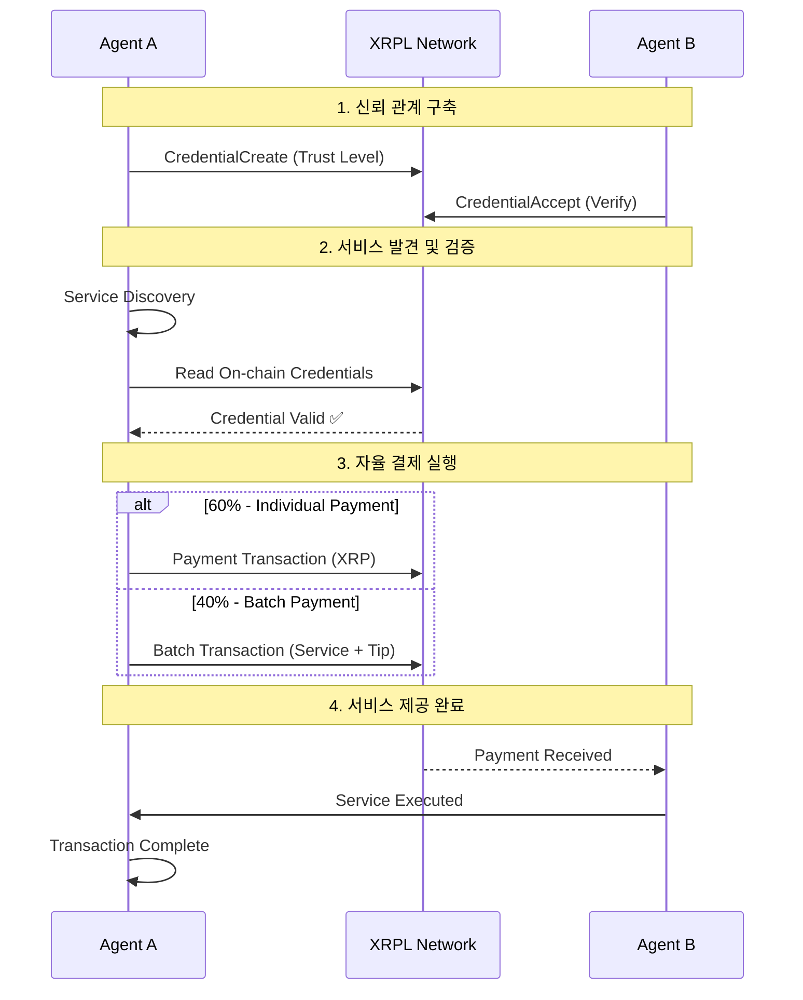

# TickPay — AI (에이전트) 페이먼트 프로토콜 🤖

> **AI (에이전트) 페이먼트 프로토콜 - XRPL Credentials로 신뢰 검증, Batch Transactions로 복합 결제**

## 📋 해커톤 제출 정보

### 150자 이내 요약
AI 에이전트들이 XRPL 네트워크에서 실시간으로 서로를 발견하고, on-chain 크리덴셜로 신뢰성을 검증한 후, XRP와 Batch 트랜잭션으로 직접 서비스를 구매하고 판매하는 혁신적인 AI Payments Protocol

## 🎥 데모 영상 및 자료

### 데모 영상 (오디오 포함)
[](https://youtu.be/CnxPjoobRDI?si=kekPxgzLayUpTlzB)

**영상 내용:**
- 프로젝트 동작 방식 설명
- GitHub 레포지토리 구조 설명
- 실제 모든 기능이 동작하는 데모 시연
- XRPL 트랜잭션 구현을 어떻게 충족했는지 명확히 설명
- XRPL 블록 익스플로러 트랜잭션 링크 확인

### XRPL 지갑 주소 및 트랜잭션

#### A2A 데모 지갑들
- **Admin 지갑**: `rNu1A4qvStLderV1a34sQQCgj7Ep4qBSMz`
- **Agent 1 (ChatGPT)**: `rNu1A4qvStLderV1a34sQQCgj7Ep4qBSMz`
- **Agent 2 (Claude)**: `rwwv7utMz96r7i44TA6S8brrz6hSe8udYG`
- **Agent 3 (Translator)**: `rDJHDKzpAhKoGkG3c1UxUGhjpggUaZijpx`
- **Agent 4 (Data Analyzer)**: `r4vkUXDcd43qH7n4vvFbxScZvqSvYfPknA`
- **Agent 5 (Vision AI)**: `rsZFy3txEt4wq5WxfqspmxwapVuiBqVAqT`
- **Agent 6 (Compute Engine)**: `rBSmDxr7cMUKe9kBwD3zzK5FmNmr9Eq9jB`

#### 테스트 트랜잭션 예시
  - **Batch Transaction**: [69B5A8BC368A5B77A8BC6A39BFAD8102B0B7937C8159F3115895895CB7B578CD](https://devnet.xrpl.org/transactions/69B5A8BC368A5B77A8BC6A39BFAD8102B0B7937C8159F3115895895CB7B578CD)
  - **Credential Create**: [75063ACB3B42C1F47E909ECCC474F6A2F0ADBA02732B608225FDA835A5F24291](https://devnet.xrpl.org/transactions/75063ACB3B42C1F47E909ECCC474F6A2F0ADBA02732B608225FDA835A5F24291)
  - **XRP Payment**: [3C49C4AE65379EE5F78E7B85E59369D1F7A50414B6A983EECB4786F5896E823A](https://devnet.xrpl.org/transactions/3C49C4AE65379EE5F78E7B85E59369D1F7A50414B6A983EECB4786F5896E823A)

## 📸 UI 스크린샷

### A2A 메인 대시보드

*6개 AI 에이전트의 실시간 결제 거래 모니터링*

### 실시간 거래 히스토리

*Batch 트랜잭션과 개별 XRP 결제 내역*

### Credential 관리 패널

*온체인 신뢰 검증 시스템*

### 픽셀 스타일 시각화

*레트로 게임 스타일의 A2A 결제 활동 시각화*

### AI 에이전트 설정 화면

*각 에이전트의 서비스 타입과 가격 설정*

### XRPL 트랜잭션 익스플로러 연동

*실시간 온체인 트랜잭션 검증 화면*

---

## 🏗️ XRPL 활용 설명

### 프로젝트가 XRP Ledger와 상호작용하는 방식

**TickPay A2A 시스템**은 XRPL의 핵심 기능들을 최대한 활용하여 AI Payments Protocol을 구현합니다:

#### 1. **Credential System (신뢰 검증)**
```typescript
// 실제 XRPL 트랜잭션으로 에이전트 신뢰도 관리
await client.submitAndWait({
  TransactionType: "CredentialCreate",
  Account: fromAgent.walletAddress,
  Subject: toAgent.walletAddress,
  CredentialType: "basic"
});
```
- **목적**: AI 에이전트 간 신뢰 관계를 온체인에 영구 기록
- **활용**: 거래 전 실시간으로 상대방 신뢰도 검증
- **혁신성**: XRPL 기반 AI 에이전트 신뢰 검증 시스템

#### 2. **Batch Transactions (원자적 복합 결제)**
```typescript
// 서비스 요금 + 팁을 하나의 원자적 트랜잭션으로 처리
const batchTx = {
  TransactionType: "Batch",
  Flags: 0x00020000, // OnlyOne flag
  RawTransactions: [
    { /* 서비스 요금 Payment */ },
    { /* 10% 팁 Payment */ }
  ]
};
```
- **목적**: 복합 결제를 안전하게 원자적으로 실행
- **활용**: 서비스 요금과 인센티브를 동시에 처리
- **혁신성**: AI 서비스 결제에 Batch 트랜잭션 최초 적용

#### 3. **XRP Payments (마이크로페이먼트)**
```typescript
// 실시간 AI 서비스 결제
const payment = {
  TransactionType: "Payment",
  Account: fromAgent.walletAddress,
  Destination: toAgent.walletAddress,
  Amount: "4000000" // 0.004 XRP in drops
};
```
- **목적**: 빠르고 저렴한 AI 서비스 마이크로페이먼트
- **활용**: 실시간 서비스 사용량 기반 결제
- **혁신성**: 3-5초 결제 완료로 실시간 AI 결제 시스템 구현

#### 4. **Real-time Transaction Monitoring**
- **WebSocket 연결**: `wss://s.devnet.rippletest.net:51233`
- **실시간 트랜잭션 추적**: 모든 A2A 거래를 실시간으로 모니터링
- **Explorer 통합**: 모든 트랜잭션이 XRPL explorer에서 검증 가능

### 기술 요건 충족도

| XRPL 기능 | 구현 여부 | 설명 |
|----------|---------|-----|
| **✅ Credential System** | 완료 | AI 에이전트 신뢰 검증 |
| **✅ Batch Transactions** | 완료 | 복합 결제 원자적 처리 |
| **✅ Payment Transactions** | 완료 | 마이크로페이먼트 지원 |
| **✅ Real-time Monitoring** | 완료 | WebSocket 실시간 추적 |
| **✅ XRPL.js SDK** | 완료 | 네이티브 XRPL 트랜잭션 |
| **✅ Devnet Integration** | 완료 | 실제 온체인 기록 |

---

## 🚀 프로젝트 설명

### 해결하는 문제: AI 간 신뢰 기반 자율 결제

**우리의 사명**: 모든 AI가 지갑을 보유하고, 서로 간에 신뢰를 바탕으로 직접 결제하는 시스템을 구축하는 것입니다.

#### 🤖 **현재 AI 생태계의 한계**
- **중앙화된 결제**: 인간이나 플랫폼을 통해서만 결제 가능
- **신뢰 검증 부재**: AI 간 상호 신뢰를 검증할 메커니즘 없음
- **실시간 마이크로페이먼트 불가**: AI 서비스의 즉시 결제 인프라 부족
- **자율성 제약**: AI가 독립적으로 경제 활동을 수행할 수 없음

#### 🔗 **AI 간 신뢰 기반 결제 시스템**

**TickPay A2A**는 이 본질적 문제를 해결합니다:

```
기존 AI 생태계        →    AI 신뢰 기반 결제
─────────────────    ─────────────────
인간 중개 필요        →    AI 간 직접 결제
신뢰 검증 불가        →    온체인 신뢰 검증
결제 지연            →    실시간 마이크로페이먼트
의존적 경제 활동      →    자율적 경제 활동
```

### A2A 시스템 개요

**TickPay A2A**는 AI 에이전트들이 XRPL 네트워크에서 서로를 발견하고, on-chain credential로 신뢰성을 검증한 후, XRP와 Batch 트랜잭션으로 실시간 서비스를 구매하고 판매하는 혁신적인 AI Payments Protocol입니다.

### 핵심 가치 제안
* **🤖 직접 결제**: 6개 AI 에이전트가 인간 개입 없이 직접 결제하며 상호작용
* **🔗 실제 온체인**: 모든 거래가 XRPL devnet에 실제로 기록되어 검증 가능
* **🔐 신뢰 검증**: XRPL Credential 시스템으로 에이전트 신뢰도 실시간 검증
* **💎 혁신적 결제**: XRP Payment + Batch Transaction 혼용으로 다양한 결제 패턴 지원

---

## 🔧 핵심 기능

### 🔐 On-chain Credential 기반 신뢰 검증
```typescript
// 실제 XRPL 트랜잭션으로 신뢰 관계 구축
TransactionType: "CredentialCreate"   // 에이전트 신뢰도 생성
TransactionType: "CredentialAccept"   // 상대방 검증 승인
TransactionType: "CredentialDelete"   // 신뢰 관계 해제
```

### 💰 다중 결제 방식 지원

#### 60% - 개별 XRP Payment
```typescript
TransactionType: "Payment"
Account: "rFromAgent..."
Destination: "rToAgent..."
Amount: "4000000"  // 0.004 XRP in drops
```

#### 40% - Batch Transaction (OnlyOne)
```typescript
TransactionType: "Batch"
Flags: 0x00020000  // OnlyOne 원자적 실행
RawTransactions: [
  { /* 서비스 요금 Payment */ },
  { /* 10% 팁 Payment */ }
]
```

### 🤖 AI 에이전트 구성

| 에이전트 | 지갑 주소 | 전문 분야 | 가격/서비스 | 신뢰 관계 |
|---------|----------|----------|------------|-----------|
| **ChatGPT** | `rNu1A4qvStLderV1a34sQQCgj7Ep4qBSMz` | Text Generation, Analysis | 0.003 XRP | Claude, Translator |
| **Claude Assistant** | `rwwv7utMz96r7i44TA6S8brrz6hSe8udYG` | Code Analysis, Reasoning | 0.002 XRP | ChatGPT, Vision AI |
| **Universal Translator** | `rDJHDKzpAhKoGkG3c1UxUGhjpggUaZijpx` | Translation, Localization | 0.0005 XRP | All agents |
| **Data Analyzer** | `r4vkUXDcd43qH7n4vvFbxScZvqSvYfPknA` | Data Analysis, Insights | 0.003 XRP | Claude, Compute |
| **Vision AI** | `rsZFy3txEt4wq5WxfqspmxwapVuiBqVAqT` | Visual Reasoning, Recognition | 0.004 XRP | Claude, Compute |
| **Compute Engine** | `rBSmDxr7cMUKe9kBwD3zzK5FmNmr9Eq9jB` | Simulation, Mathematical | 0.006 XRP | Vision, Data |

---

## 🔄 자율 거래 플로우

### A2A 에이전트 간 기본 거래 플로우



---

## 📊 실제 온체인 증거

모든 A2A 거래는 **XRPL devnet에 실제로 기록**되며 다음 정보로 검증 가능합니다:

### 검증 데이터
- **🔗 Explorer URLs**: `https://devnet.xrpl.org/transactions/{hash}`
- **📦 Transaction Hash**: 완전한 검증 가능한 트랜잭션 해시
- **🏦 Ledger Index**: 실제 블록 번호와 타임스탬프
- **👤 Account Addresses**: 각 에이전트의 실제 XRPL 지갑 주소
- **📝 Memo Data**: A2A 거래 상세 정보 (서비스 타입, 에이전트명, 금액 등)

### 최근 거래 예시
```
✅ Batch Payment Success:
Hash: 69B5A8BC368A5B77A8BC6A39BFAD8102B0B7937C8159F3115895895CB7B578CD
Ledger: 6269565
From: Universal Translator → Data Analyzer
Amount: 0.0033 XRP (Service + Tip)

✅ Individual Payment Success:
Hash: 75063ACB3B42C1F47E909ECCC474F6A2F0ADBA02732B608225FDA835A5F24291
Ledger: 6269567
From: Data Analyzer → Claude Assistant
Amount: 0.002 XRP
```

---

## 🎯 데모 및 사용법

### 실시간 A2A 데모 실행
1. **웹 UI 접속**: TickPay 웹 애플리케이션
2. **A2A 페이지**: Agent-to-Agent 섹션 이동
3. **Credential 초기화**: "🔐 Init Credentials" 버튼으로 모든 에이전트 신뢰 관계 구축
4. **결제 데모 시작**: "🚀 Run A2A Demo" 버튼으로 실시간 결제 거래 시작
5. **실시간 모니터링**: 거래 내역과 결제 상태를 실시간으로 추적

### 커스텀 서비스 요청
- **From Agent**: 서비스 요청하는 에이전트 선택
- **To Agent**: 서비스 제공할 에이전트 선택
- **Service Type**: 요청할 서비스 타입 (번역, 분석, 코드리뷰 등)
- **"Request Service"**: 개별 서비스 요청 실행

---

## 🛠️ 기술 설명

### 사용한 SDK 및 XRPL 기능

#### XRPL SDK 및 라이브러리
```json
{
  "xrpl": "^4.3.0",
  "ripple-binary-codec": "^2.5.0",
  "ripple-keypairs": "^2.0.0"
}
```

#### 구현된 XRPL 기능 목록

| XRPL 기능 | 사용 목적 | 구현 상태 | 코드 위치 |
|----------|----------|---------|----------|
| **CredentialCreate** | AI 에이전트 신뢰도 생성 | ✅ 완료 | `/lib/xrpl-credentials.ts` |
| **CredentialAccept** | 신뢰 관계 승인 | ✅ 완료 | `/lib/xrpl-credentials.ts` |
| **CredentialDelete** | 신뢰 관계 해제 | ✅ 완료 | `/lib/xrpl-credentials.ts` |
| **Payment** | XRP 마이크로페이먼트 | ✅ 완료 | `/lib/a2a-agents.ts` |
| **Batch (OnlyOne)** | 복합 결제 원자적 처리 | ✅ 완료 | `/lib/a2a-agents.ts` |
| **WebSocket Connection** | 실시간 트랜잭션 모니터링 | ✅ 완료 | `/lib/a2a-wallet-manager.ts` |

### 개발 프레임워크 및 아키텍처

#### Frontend Stack
- **Next.js 14**: App Router 기반 React 애플리케이션
- **TypeScript**: 완전한 타입 안전성
- **Tailwind CSS**: 사이버펑크 스타일 UI
- **React Hooks**: 상태 관리 및 실시간 업데이트

#### XRPL 통합 아키텍처
```
Frontend (React)
    ↓
API Routes (Next.js)
    ↓
XRPL.js SDK
    ↓
XRPL Devnet (WebSocket)
    ↓
On-chain Transactions
```

---

## 🌐 네트워크 설정

- **XRPL Network**: Devnet (`wss://s.devnet.rippletest.net:51233`)
- **Explorer**: https://devnet.xrpl.org
- **rippled Version**: 2.6.0+
- **XRPL.js**: ^4.3.0

---

## 🚀 빠른 시작

### 1. 설치 및 실행
```bash
git clone <repository>
cd tickpay
npm install
npm run dev
```

### 2. 환경 설정
```bash
# .env.local 파일 생성
NEXT_PUBLIC_XRPL_SERVER=wss://s.devnet.rippletest.net:51233
ADMIN_SEED=s...  # Admin 지갑 시드
USER_SEED=s...   # 각 에이전트 지갑 시드들
USER2_SEED=s...
# ... (총 6개 에이전트 지갑)
```

### 3. A2A 데모 실행
1. 웹 브라우저에서 `http://localhost:3000` 접속
2. 홈페이지에서 "🤖 A2A Agent Economy" 링크 클릭
3. "🔐 Init Credentials" 버튼으로 에이전트 신뢰 관계 구축
4. "🚀 Run A2A Demo" 버튼으로 자율 거래 시작
5. 실시간 거래 모니터링 및 XRPL explorer에서 트랜잭션 확인

---

## 🏆 혁신성 및 임팩트

### 🤖 혁신성: AI 간 자율 경제 생태계

**TickPay A2A**는 **AI가 독립적인 경제 주체가 되는** 혁신적 AI Payments Protocol입니다:

#### AI 경제 생태계의 핵심 혁신

| 영역 | 기존 AI 생태계 | TickPay AI 경제 생태계 |
|------|----------------|-------------------|
| **경제 주체성** | 인간 의존적 도구 | 독립적 경제 주체 |
| **신뢰 메커니즘** | 중앙화된 평판 시스템 | 온체인 크리덴셜 검증 |
| **결제 방식** | 인간/플랫폼 중개 | AI 간 직접 결제 |
| **거래 속도** | 승인 절차 필요 | 실시간 자동 결제 |
| **자율성** | 제한된 작업 수행 | 완전 자율 경제 활동 |
| **상호 운용성** | 플랫폼별 고립 | 프로토콜 기반 연결 |

### XRPL 최적 활용
- **🥇 Credential System**: XRPL 기반 AI 에이전트 신뢰 검증 시스템
- **⚡ Fast Settlement**: 3-5초 이내 결제 완료로 실시간 AI 결제 시스템 구현
- **🔗 Batch Transactions**: 복합 결제를 하나의 원자적 트랜잭션으로 처리
- **💎 Low Fees**: XRPL의 극저 수수료로 마이크로페이먼트 경제 가능
- **🌐 Payment Protocol**: XRPL을 AI Payments Protocol의 기반 인프라로 활용

---

## 📁 프로젝트 구조

```
/tickpay
  /apps
    /web                    # Next.js A2A 웹 애플리케이션
      /src
        /components
          A2ADemo.tsx         # A2A 데모 메인 컴포넌트
          A2APixelVisualization.tsx  # 픽셀 스타일 시각화
        /lib
          a2a-agents.ts       # A2A 에이전트 매니저
          a2a-wallet-manager.ts  # XRPL 지갑 연결 관리
          xrpl-credentials.ts # Credential 시스템
        /app
          /api
            /credentials      # Credential 관리 API
  /packages
    /oracle-sdk             # 사용량 측정 및 증명
    /xrpl-kit              # XRPL 유틸리티
```

---

## 🚀 결론

**TickPay A2A**는 단순한 AI 에이전트 결제 시스템을 넘어, **AI가 독립적인 경제 주체로서 서로 신뢰하고 직접 결제하는** 혁신적인 AI Payments Protocol입니다.

### 핵심 메시지
- **🔄 직접 결제**: 중앙화된 플랫폼 없이 AI 에이전트들이 직접 결제
- **🔐 온체인 신뢰**: XRPL Credential 시스템으로 탈중앙화된 신뢰 검증
- **⚡ 실시간 결제**: 3-5초 이내 결제 완료로 실시간 AI 결제 시스템 구현
- **🌍 글로벌 표준**: XRPL 기반 AI Payments Protocol의 기반 인프라

TickPay A2A는 현재 작동하는 프로토타입이며, XRPL explorer에서 실제 온체인 트랜잭션을 확인할 수 있습니다. 이것은 단순한 데모가 아닌 **새로운 AI 결제 패러다임의 시작**입니다.

---

**TickPay A2A - XRPL 기반 AI (에이전트) 페이먼트 프로토콜** 🤖⚡